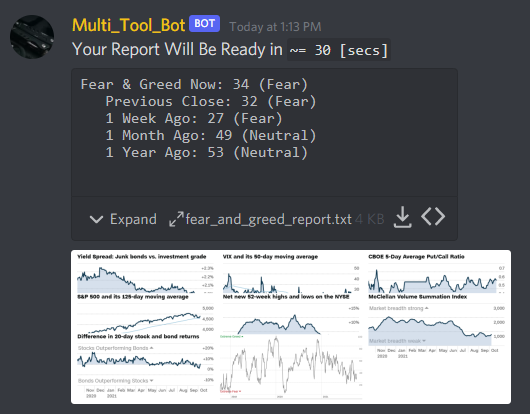
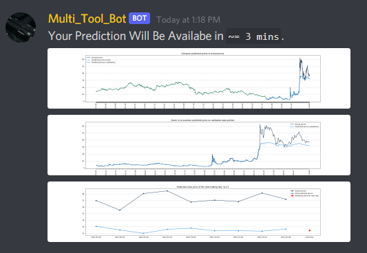

# Discord_Bot
## What is it?
* A ***Multi_Tool_Discord_Bot*** that combines several pre-existing bots together and implements new features.


## What can it do?
### ResourceBot
* Send links from your emails to a channel.
### Finance-Bot
* Send financial data to a channel when given a ticker symbol (yfinance).
### ConsumerSentiment
* Sends user dataframe from [CNN greed and fear gauge](https://github.com/DidierRLopes/fear-greed-index).
### [fearAndGreedIndex](https://github.com/DidierRLopes/fear-greed-index)
* Sends user matplotlib image and report on [CNN greed and fear gauge](https://money.cnn.com/data/fear-and-greed/).
* Slightly modified from [this repo](https://github.com/DidierRLopes/fear-greed-index).


### [predictStock](https://www.alphavantage.co/academy/)
* Sends user three `.png`'s of prediction from input symbol.
* uses [Aslpha Vantage API](https://www.alphavantage.co/support/#api-key)

    
### discordWeatherBot
* Send weather data to a channel.
* Play music on a discord channel.(To do)
### statsBot
* Sends user message data to a channel.(To do)
### youTubeBot
* Sends user youTube link to a channel to play be played.
### Other
* Return random video from YouTube/Twitter, etc.?
* Return visuals from downdetector on internet outages.(To do)
  
  -  [AT&T](https://downdetector.com/status/att/)
  -  [Xfinity](https://downdetector.com/status/xfinity/)
  -  Other Service?
* Other

# Setup
1. [Install Anaconda.](https://docs.anaconda.com/anaconda/install/index.html)
2. Create a [new conda environment](https://docs.conda.io/projects/conda/en/latest/_downloads/843d9e0198f2a193a3484886fa28163c/conda-cheatsheet.pdf) from wherever you have access to your Python `base`.  (i.e. Anaconda Command Prompt)
```
conda create --name discobotenv
```
3. Activate the created conda environment.
```
conda activate discobotenv
```
4. Install `python-dotenv` (for .env file with API token).
```
pip install python-dotenv
```
5. Install `discord` module.
```
# Windows install
py -3 -m pip install -U discord.py
```
```
# Linux/macOS
python3 -m pip install -U discord.py
```
6. Install `logging` module.
```
pip install logging
```
7. Install `yfinance` module.
```
pip install yfinance
```
8. Install `bs4` module.
```
pip install bs4
```
9. Install `emails` module.
```
pip install emails
```
10. Install `torch` module.
```
pip install torch
```
11. Install `alpha_vantage` module.
```
pip install alpha_vantage
```
12. Install `tweepy` module.
```
pip install tweepy
```
13. Launch your Python editor.
```
jupyter-lab
```

# To Do Before Deployment:
- [ ] **Transfer `.ipynb` file to regular `.py` file.**
- [x] Hosting the bot?
  - [x] [NVIDIA JETSON NANO](https://www.google.com/search?q=host+discord+bot+on+raspberry+pi&rlz=1C1CHBF_enUS900US900&oq=HOST+DISCORD+BOT+ON+RAS&aqs=chrome.0.0i512j69i57j0i22i30.6391j0j7&sourceid=chrome&ie=UTF-8)
    - [x] Got This Up and Running
  - [ ] CLOUD SERVER?
- [ ] Dress up the markdown.
- [ ] Post on discord bot site.

# Deploy Bot:
```
python multi_tool_disco_bot.py
```
or
```
python3 multi_tool_disco_bot.py
```
